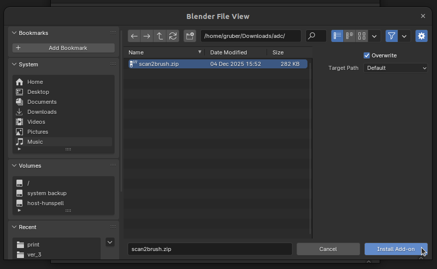
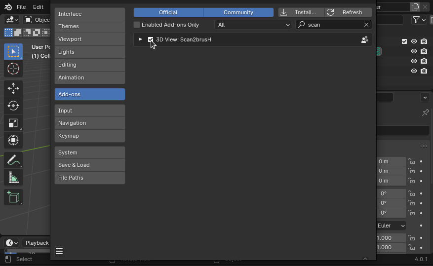
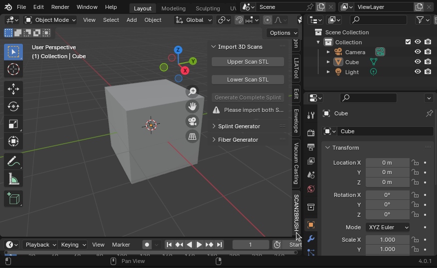

# Detailed Installation

This section explains the full setup for the **Scan2brusH™ Dental Workflow Module** in Blender 4.0.1.

Choose your operating system below:

## 1. Install Blender 4.0.1

> If you already have Blender 4.0.1 installed, you can skip this step.

=== "Windows"

    1. Download:

        - [Windows Installer (.msi)](https://download.blender.org/release/Blender4.0/blender-4.0.1-windows-x64.msi){ .md-button .s2b-btn }
        - [Portable Version (.zip)](https://download.blender.org/release/Blender4.0/blender-4.0.1-windows-x64.zip){ .md-button .s2b-btn }

    3. Install Blender normally, or unzip and run `blender.exe`.

=== "macOS"

    1. Download:

        - [Apple Silicon (.dmg)](https://download.blender.org/release/Blender4.0/blender-4.0.1-macos-arm64.dmg){ .md-button .s2b-btn }
        - [Intel x64 (.dmg)](https://download.blender.org/release/Blender4.0/blender-4.0.1-macos-x64.dmg){ .md-button .s2b-btn }

    3. Open the `.dmg` and drag **Blender** into **Applications**.

=== "Linux"

    1. Download:

        - [Linux archive (.tar.xz)](https://download.blender.org/release/Blender4.0/blender-4.0.1-linux-x64.tar.xz){ .md-button .s2b-btn }

    3. Extract and run the `blender` executable.

## 2. Download the Scan2brusH add-on

> This step is the same for all operating systems.

1. Download the official add-on package (`.zip`):  
   [Download Scan2brusH Add-on](https://drive.google.com/uc?export=download&id=1gTvzbILzaNwukF3XCY0hvHiYPBHUN-Zb){ .md-button .md-button--primary .s2b-btn }

2. **Do not unzip** — Blender installs add-ons directly from `.zip`.

## 3. Install the add-on in Blender

=== "Windows / Linux"

    1. Start **Blender 4.0.1**.
    2. Go to **Edit → Preferences**.  
       

    3. Select **Add-ons**.  
       

    4. Click **Install…**.  
       

    5. Select the downloaded `scan2brush.zip`.  
       

       Blender will install the add-on automatically.

    6. Search for `scan2brush`.  
       

    7. Enable the add-on.  
       

    8. After enabling, the **Scan2brusH panel appears in the right-hand sidebar**.  
       

=== "macOS"

    1. Start **Blender 4.0.1**.
    2. Go to **Blender → Preferences**.  
       

    3. Select **Add-ons** in the left panel.  
       

    4. Click **Install…**.  
       

    5. Select `scan2brush.zip` and confirm.  
       

       Blender will install the add-on automatically.

    6. Search for `scan2brush` and enable it.  
       

    7. After enabling, the **Scan2brusH panel appears in the right-hand sidebar**.  
       

!!! warning "Important — first installation only"
    After enabling the add-on, **restart Blender completely** before using Scan2brusH.

Once Blender restarts, the add-on is installed and ready to use.
